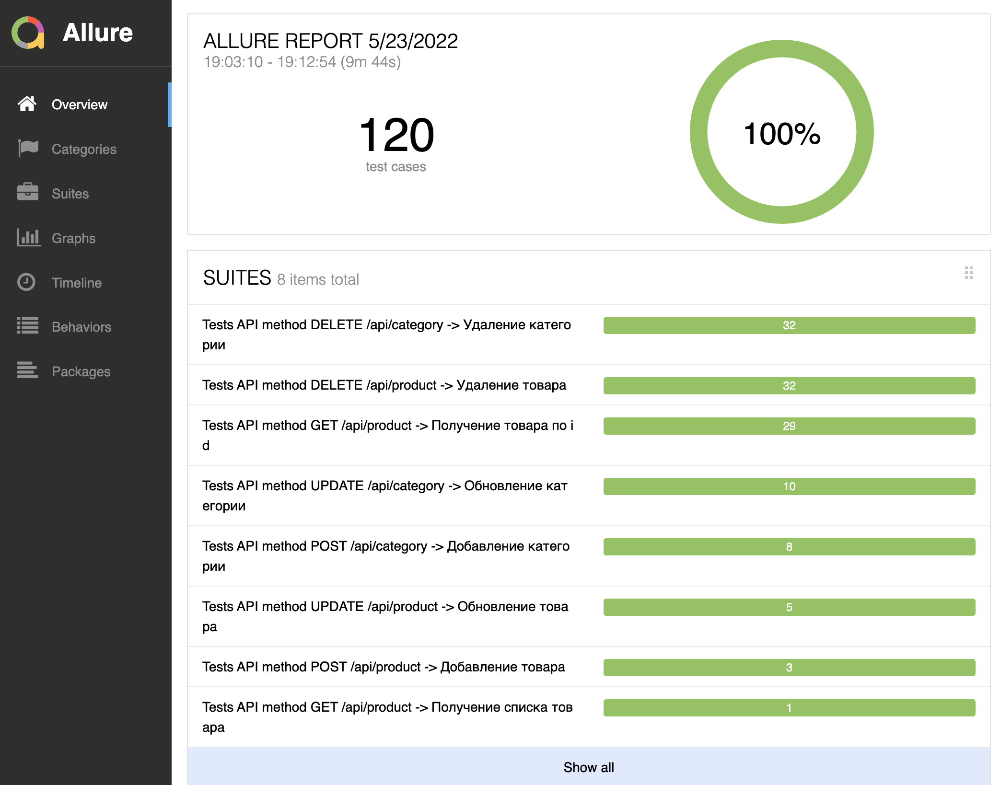
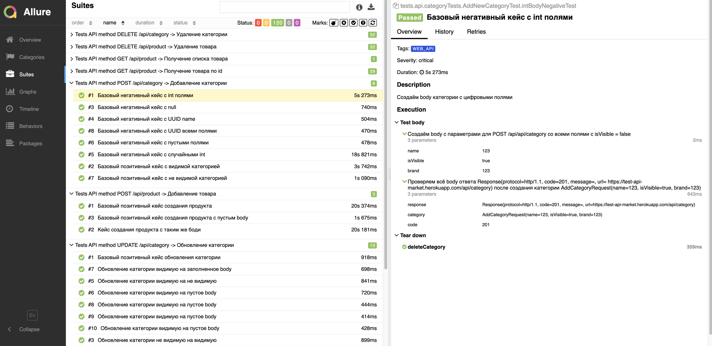
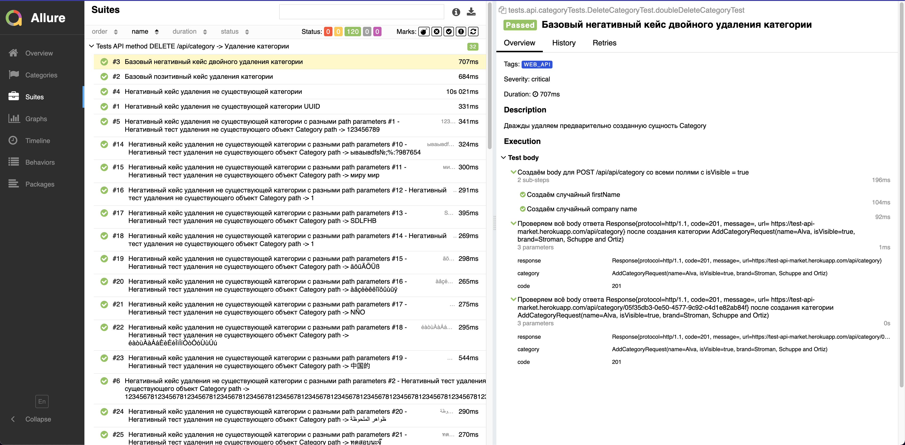

# Kotlin API testing automation framework

### Simple API test to https://test-api-market.herokuapp.com/swagger-ui/index.html#

Пример тестов, которые можно реализовать для тестирования службы REST API, предоставляющей интерфейс CRUD.

##### Этот проект построен со стеком: `Kotlin + Retrofir 2 + Junit5 + Allure + Jackson`

### Endpoints:

Метод `POST /api/caterogy` Добавление категории
Метод `DETELE /api/caterogy/{categoryId}` Удаление категории по id
Метод `PATCH /api/caterogy/{categoryId}` Изменение категории по id

Метод `POST /api/product` Добавление товара
Метод `GET /api/product/{producetId}` Получение товара по id
Метод `DELETE /api/product/{producetId}` Удаление товара по id
Метод `PATCH /api/product/{producetId}` Изменение товара по id
Метод `GET /api/products` Получение списка товаров

## Запуск и прогон тестов

1. Склонировать репозиторий, выполнив команду в терминале `git clone git@github.com:ivan-strelka/testTaskBlancBank.git`
2. Перейти в директорию с проектом, выполнив команду в терминале  `cd testTaskBlancBank`
3. Запустить прогон тестов, выполнив команду в терминале `gradle clean api --stacktrace --info`
4. Запустить скачивание отчёта Allure, выполнив команду в терминале  `gradle downloadAllure`
5. Запустить загрузку отчёта Allure, выполнив команду в терминале `gradle allureServe`
6. Наслаждайтесь результатами тестового прогона :)

### Некоторые примеры результатов тестового запуска в отчете Allure:

